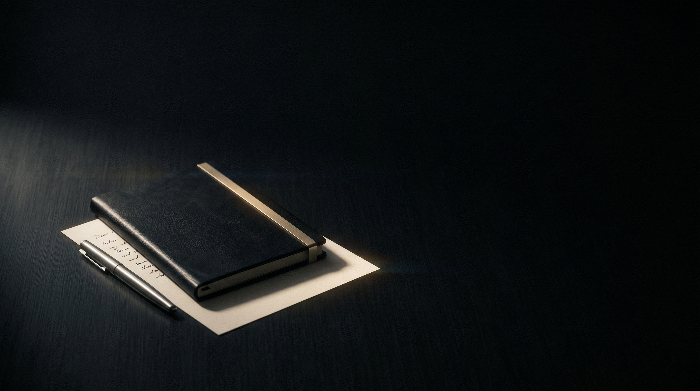

<div align="center">

# ZENITH

**Write in the void.**

</div>



<div align="center">

*A text editor with nothing to prove and nothing to sell you.*
<br>
*It opens. You write. It remembers. That is the entire relationship.*

</div>

---

## What this is

A local-first writing surface for people who find every other editor too loud.

No accounts. No cloud. No telemetry. No one is watching you write, because no one was ever going to. Your words live on your disk in plain files. Close the internet and nothing changes.

It does less than the alternatives. That is the point. What remains is the page, your attention, and one quiet thing in the corner.

## What it does

- **A blank column and nothing else.** The chrome stays hidden until you ask for it.
- **A toolbar of the few things you actually use.** Bold. Italic. The handful that matter. The rest was noise, and noise was removed.
- **Commands, not menus.** Type `/` for tables, lists, images, code. The necessary ones. No more.
- **Focus Mode.** The room dims. You do not.
- **Typewriter scrolling.** The line you are writing stays where your eyes already rest.
- **Hear it back.** Built-in text-to-speech reads your work aloud, so you catch what the eye forgives.
- **Scale to taste.** The interface moves from 20% to 500% and never breaks.
- **Quiet organization.** Folders, tags, a sidebar that appears when summoned and leaves when finished.
- **One key for everything.** `Ctrl/Cmd + K` opens the command palette. Search, create, export, switch modes.
- **It saves itself.** You will not be asked. You will not be thanked.
- **Export when you must.** Markdown. PDF. Then back to the page.


## The companion

There is a creature in the corner.

It does nothing. That is the most expensive thing it could do.

It breathes. It rarely moves. When you have written for a long time without stopping, it stretches, once. Late at night, it sleeps. You can pick it up and put it anywhere on the screen, and it will stay exactly where you left it, indefinitely, without comment.

It will never suggest, interrupt, or ask. It keeps you company while you work, the way good company does. Quietly, and without needing to be noticed.

## Install

Download the latest build from [**Releases**](https://github.com/onionclub/zenith/releases).

- **Windows** — run the `.exe`.
- **macOS** — open the `.dmg`, drag Zenith to Applications. The build is unsigned, so on first launch macOS will object. Clear it once:

  ```bash
  xattr -cr /Applications/Zenith.app
  ```

That is the only thing it will ever ask of you.

## Build from source

You will need [Node.js](https://nodejs.org), the [Rust toolchain](https://rustup.rs), and the [Tauri v2 prerequisites](https://v2.tauri.app/start/prerequisites/) for your platform.

```bash
git clone https://github.com/onionclub/zenith.git
cd zenith
npm install
npm run tauri dev      # run locally
npm run tauri build    # produce a release binary
```

### Notes for anyone working on it

A few constraints, learned the expensive way. Respect them and the build stays quiet.

- Vite must use a **relative base** (`base: './'`). Absolute paths break Tauri's local file protocol and you get a white screen.
- The CSP `style-src` must include `'unsafe-inline'`. The animation and styling layers inject inline styles.
- File-system scopes live in `src-tauri/capabilities/default.json`, not `tauri.conf.json`.
- The asset protocol is configured via `tauri.conf.json` -> `security.assetProtocol`.
- `.cargo/config.toml` is git-ignored on purpose. It carries an absolute target path whose colon breaks macOS linking.
- CI release jobs require `permissions: contents: write` at the job level.
- macOS builds run on the `macos-14` runner (ARM64). `macos-latest` is Intel.

## Stack

| Layer | Choice |
|-------|--------|
| Shell | Tauri v2 (Rust) |
| Frontend | React 19 · TypeScript · Vite |
| Editor | TipTap (ProseMirror) |
| Styling | Tailwind CSS v4 |
| Motion | Framer Motion |
| State | Zustand |
| Storage | Local plain files. Yours. |

A finished build is roughly 4 MB. The alternatives ship a browser. We did not.

## What it costs

Free, or paid once, because you wanted to. There is no subscription. Nothing is held behind a wall. The companions are the only thing you can pay extra for, and they are decorative. They change nothing about the work.

The price is indifferent to your decision. So should you be.

## License

See [LICENSE](LICENSE).


<div align="center">

*Perfection is not a feature. It is a prerequisite.*

**Write in the void.**

</div>
